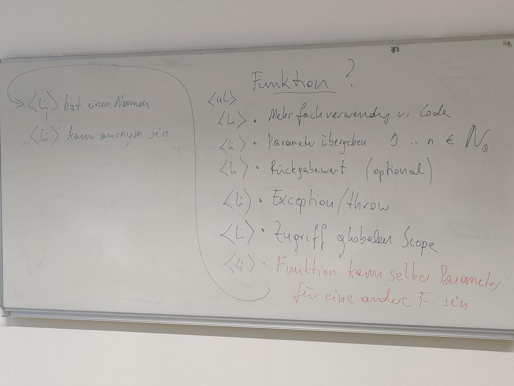

# Historie zum Unterricht - revers chronologisch

## function

-   Befehl zum Ausführen
-   function hat einen Namen damit man den code öfter ausführen kann!
-   bekommt Parameter

```js
function f (parameter, ... ) {
   // Aktion mit parameter(n) ...
   throw new Error ("Fehler!");
   return ergebnis;
}

try {
  // irgendwas wo dann throw passiert
} catch (error) {
  // Abhandlung des Problems, z.B.:
  console.log(error);
}
```



## HÜ 2023-10-03

-   https://developer.mozilla.org/en-US/docs/Web/JavaScript/Reference/Global_Objects/Promise
    studieren!
-   Schreibe ein kleines Javascript Programm welches eine Funktion enthält, die
    bei bestimmten Parametern einen Error wirft. Rufe diese Funktion innerhalb
    einer Schleife 10-20 mal auf, so daß manchmal eine Exception geworfen wird
    und manchmal nicht. Dein Programm soll NIE selber eine Exception werfen!

## 2023-09-26

Flexbox Froggy. Mache die Levels alle durch und lade in Dein Repo einen
Screenshot vom höchsten Level durch, den Du geschafft hast!

## 2023-09-19

Auf github public apis ein Api wählen (ohne auth, ohne cors) und dieses so wie
im Video gesehen auf eigene Webseite implementieren.

Video: https://youtu.be/f4D50VnO_Gw

Im VSCode: REst-Client Plugin verwenden!

Api doc:
https://github.com/alexwohlbruck/cat-facts/blob/master/docs/endpoints/facts.md

-   wie baue ich das Ergebnis vom api in meine website ein?
-   cors (siehe eigenes File)

## 2023-09-12

Hausübung: rechts neben dem clickme button ein textinputfield anlegen, dessen
text bei Klick als listeneintrag an die Liste angehängt wird.

## 2023-09-05

Repositories zum Laufen kriegen!
